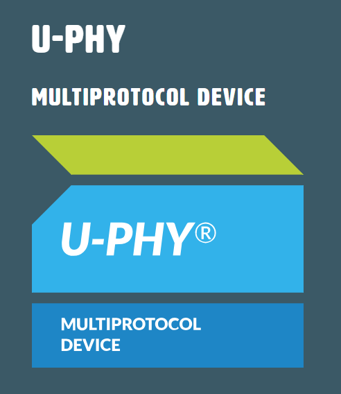
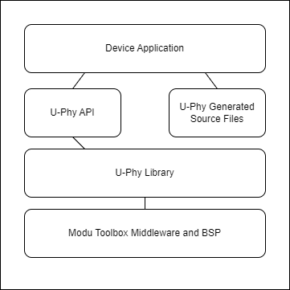
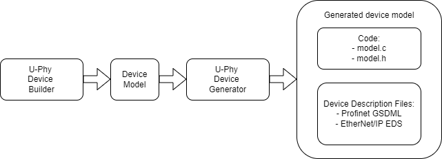
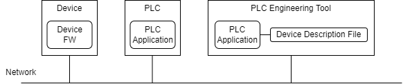

# U-Phy Middleware

## Introduction to U-Phy

The U-Phy framework from RT-Labs provides Industrial Ethernet connectivity without requiring detailed knowledge of the underlying technologies. The process data and device characteristics of a device is modelled using the U-Phy Device Builder tool. Device description files such as Profinet GSDML and EtherNet/IP EDS as well as device specific source code is generated from the model. This approach enables developers to focus on the application, creating Industrial Ethernet devices with minimal knowledge of the underlying technologies and protocols.

Key features:

- Support protocols
    - Profinet
    - EtherNet/IP
    - Modbus
- A single, unified API for all protocols, simplifying the development process
- Define process data and device characteristics using the [U-Phy Device Builder](https://devicebuilder.rt-labs.com/)
- Build-time generation of GSDML, EDS, and device-specific code
- [U-Phy User Example](https://github.com/rtlabs-com/mtb-example-uphy) - U-Phy MTB Example on GitHub
- [U-Phy Middleware](https://github.com/rtlabs-com/mtb-mw-uphy) - U-Phy MTB Middleware on GitHub
- [U-Phy](https://rt-labs.com/u-phy/) - General introduction to the U-Phy concept and features

## U-Phy for Modus Toolbox

This section is an adoption of the general U-Phy documentation to the Modus Toolbox context.

### System overview

U-Phy device overview
---------------------
The figure below shows schematic view of a U-Phy application. 

The Device Application implements the device specific features. It generates input data sent to a PLC and consumes output data that is received from a PLC.
The input/output (I/O) data can be digital IOs, sensors or actuators.
The device data can be a single sensor value or more complex with
configuration parameters, alarms and more. Boilerplate code for managing the
device IO data is displayed as "U-Phy Generated Source Files" in the figure.

The U-Phy Generated Source Files are generated using the U-Phy Device Builder
and U-Phy Device Generator tools, not shown in this figure.

The U-Phy API provides a unified API for supported protocols.

The U-Phy Library contains the protocol stacks and provides
Industrial Ethernet functionality to the application using the U-Phy API.

### Device design

A fieldbus device has several characteristics including:

- Input data
- Output data
- Configuration parameters
- Alarms

For a U-Phy device, these characteristics are referred to as the device model.
The workflow for designing and generating the device model is shown
in the figure below.

The U-Phy Device Builder is used to define the device model.
The output from the U-Phy Device Builder is a device model in json format.

The U-Phy Device Generator generates boiler plate code for managing
the device process data and device description files for selected fieldbuses
from the device model.

The generated sources together with the U-Phy API provides
fieldbus functionality to the application. For evaluation and
proof of concepts the generated code can be compiled and linked
with the Modus Toolbox example application.
The device description shall be imported into the PLC engineering tool.

### The fieldbus device context

The figure below shows a schematic PLC development environment.

The U-Phy device to the left has been explained in earlier sections.
The PLC executes a control application that is connected to the device using the network.

The PLC application is developed using a engineering tool such as
Siemens TIA portal or Codesys.
To know how to use a specific fieldbus device, a device description file  is
imported into the tool. Then the specific device can be used
in the application and application process data mapped to device IO data.
