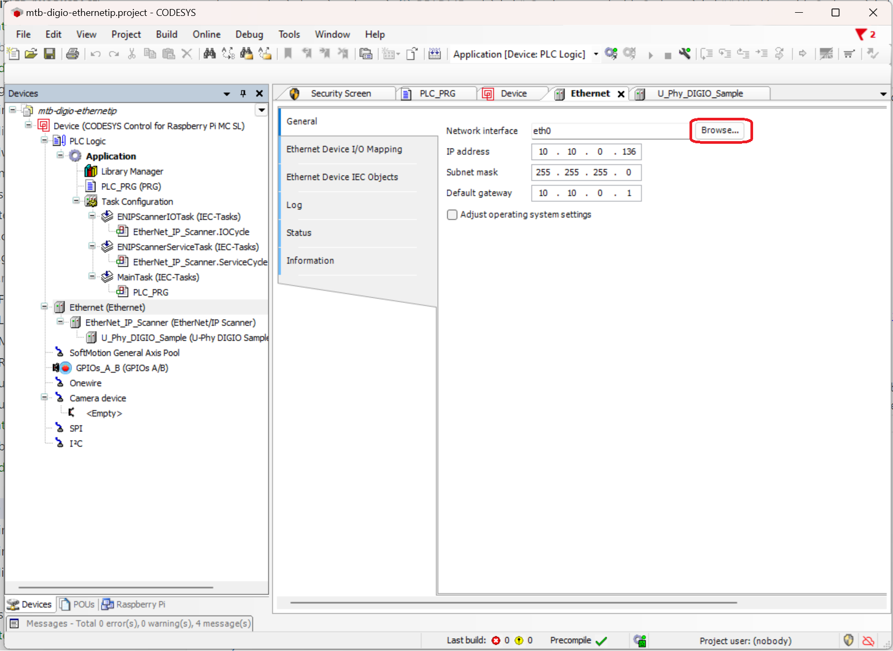

# Getting started with Codesys

The Codesys environment is a neat way to getting started with the controller side 
of device evaluation. Below follows a set of step by step guides to get started.

The guides describes how install the Codesys environment as well as a Codesys runtime on a 
Raspberry Pi. Expect the installation procedures to take a couple of hours. 
Note that the Codesys runtime runs for 2h without a valid license before it is halted.

It is recommended to run execute the Codesys runtime on a Raspberry Pi. Other options are
possible.

## Installation Guides

<details><summary><b>Installing Raspberry Pi 4</b></summary>


1. Download and install Raspberry Pi Imager from https://www.raspberrypi.com/software/

2. Start Raspberry Pi Imager

3. In the Select OS dialog choose 'Raspberry Pi OS (64 bit)'

4. Choose storage, select sdcard

5. Press Next

6. Edit Settings

7. Ensure wireless LAN is not checked.

8. Set hostname to something unique on local network e.g. 'codesys' or similar

9. Set username and password (for ssh login from codesys)

10. Save

11. Press Y when asked to erase all data on media

12. Once completed eject sdcard and insert into Rpi4

13. Power up raspberry pi

14. Find DHCP assigned IP address ```ping -4 <hostname>.local``` 
    from a windows command prompt. This IP address will be required when setting up codesys.

```
    C:\Projects\Infineon\uphy_demo_package>ping -4 codesys
    Pinging codesys.local [10.10.0.113] with 32 bytes of data:
    Reply from 10.10.0.113: bytes=32 time=1ms TTL=64
    Reply from 10.10.0.113: bytes=32 time=1ms TTL=64
```

1.   Verify SSH login works 'ssh user@ip_address
</details>
 
<details><summary><b>Installing Codesys Development System</b></summary>

Full instructions for reference (signup & login required)

[Downloading-and-installing-codesys-development-system-on-a-windows-pc](https://docs.rt-labs.com/p-net/using_codesys.html#downloading-and-installing-codesys-development-system-on-a-windows-pc) 

1. Downloading and installing Codesys Development System on a Windows PC. The program can be downloaded from https://store.codesys.com/codesys.html. A trial version is available. Registration is required.

2. Download “CODESYS Development System V3”, in the latest available version. The file is named CODESYS 64 <VERSION>.exe.

3. Install it on a Windows machine by double clicking the icon.

4. From within Codesys, install the “Codesys control for Raspberry Pi” by using the menu Tools ‣ Codesys installer.

5. In the AddOns section use Browse and search for “raspberry”.

6. Select the relevant row in the results, and click Install. When completed, there should be an entry Update Raspberry Pi available in the Tools menu.

7. Restart the program after the installation.

</details>

<details><summary><b>Installing Codesys Runtime on Raspberry Pi</b></summary>


<div style="border: 1px solid black; padding: 10px;font-family: Consolas">

1. In Codesys on Windows, use the menu Tools “Update Raspberry Pi”. 

2. Enter IP address of device under 'Select target'. (Scan button may work to detect the Rpi4 but often hangs  for several minutes and is not always finding the device using this method it is better to manually specify the IP address)

3. Enter ssh login credentials chosen during RPi OS installation.


4. Under 'CODESYS Runtime Package'press Install button to install the required runtime files onto RPi4.

5. Use “Standard” runtime in the pop-up window.

6. Press Runtime -> Start to activate runtime on Rpi4.

When asked to setup user credentials for runtime please select something simple such as 

login : rt
passwd : rt

</details>

## Working with Codesys

Sample Codesys projects are located in the ```test``` folder.
The projects shows how to integrate the the sample device into codesys PLC applications. 
To run, the projects needs to be updated with the IP addresses used the local setup.

Follow the step by step guides to configure, compile and download the projects to a Codesys runtime (PLC).

## About the test application

In each data cycle the outputs (LEDs) are updated with current value of the inputs (Buttons). This means that the button states are mapped to the LEDs when the device has an active connection with the (Codesys) controller.


The application variables ```input``` and ```output``` are mapped to the data supported by the connected device. Figure below shows the mapping for the EtherNet/IP digio device.


### Profinet
Open the example Codesys Profinet sample project and reconfigure for your local network configuration.

```
File --> Open Project --> test/mtb-digio-profinet.project
```

#### Update Gateway info
Next step is to configure Codesys gateway so it connects to the RPi. Change communications settings for your local setup as seen in figure.


#### Set IP address of device 
There are several ways to the set the ip address of the device. When Profinet is 
active the address is managed by the Profinet stack. First time the devicer run it
is useful to set the address using netcfg shell command:

```
> netcfg ip 10.10.0.117
```

#### Adjust codesys project network settings to match local network


* Press Devices tab next to Raspberry Pi tab.
* In the device tree press Ethernet (Ethernet) -> Browse
* When asked for username / password select the login credentions created in the step above where raspberry pi runtime was installed onto raspberry pi (see above). Note : this is not the same as ssh login credentials (unless same was used in both places).


* Select interface matching raspberry pi ip address (typically eth0)


#### Set U_Phy_DIGIO_Sample network settings


* Configure IP address of XMC72_EVK running U-Phy Demo application

#### Start Codesys PLC application


* Press green marked button to compile PLC application7
* Press red marked button to upload PLC application to Rpi runtime and press Yes in dialogue box.


* Press "play" button 
  


#### Verify PLC application running

The codesys applications shall show green status on all entities in the device tree.

Select PLC_PRG tab and check the inputs and outputs change when the buttons on the evaluation board are pressed.


### EtherNet/IP
Open the example Codesys EtherNet/IP sample project and reconfigure for your local network configuration.

```
File --> Open Project --> test/mtb-digio-ethernetip.project
```

#### Adjust codesys project network settings to match local network



* Press Devices tab next to Raspberry Pi tab.
* In the device tree press Ethernet (Ethernet) -> Browse
* When asked for username / password select the login credentions created in the step above where raspberry pi runtime was installed onto raspberry pi (see above). Note : this is not the same as ssh login credentials (unless same was used in both places).
* Select interface matching raspberry pi ip address (typically eth0)

#### Set IP address of device 
There are several ways to the set the ip address of the device. When Profinet is 
active the address is managed by the Profinet stack. First time the devicer run it
is useful to set the address using netcfg shell command:

```
> netcfg ip 10.10.0.117
```

#### Set EtherNet/IP Adapter network settings


Configure IP address of XMC72_EVK


#### Start Codesys PLC application

* Same steps as for profinet, please see above.

#### Verify PLC application running

* Same steps as for profinet, please see above.
